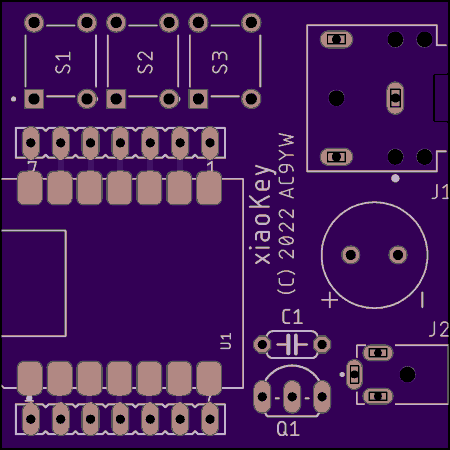

# xiaoKey

Even yet another electronic iambic keyer. 


It is a minimalist device based on:

* an inexpensive Seeed [Xiao](https://www.seeedstudio.com/XIAO-RP2040-v1-0-p-5026.html) RP2040 controller board
* [CircuitPython](https://circuitpython.org/) programs and libraries

The `code` directory has the files to be installed on the *Seeed Xiao* device.

The `pcb`directory has the Eagle schematics for a possible carrier board with connectors.

## Features

* Operates as an [iambic type B](http://wb9kzy.com/modeab.pdf) Morse code keyer with a 3.5mm stereo jack to connect to a dual-paddle telegraph key
* Has a configurable side tone transmitted through an on-board piezo buzzer
* Has an open-drain output to a 2.5mm mono jack, which should be able to key most radios (probably not tube sets)
* When connected to a PC over USB appears as two COM ports:
  * One is the *CircuitPython* REPL and console
  * A second port that shows the characters being transmitted, and also transmits Morse code for characters typed into the COM port
* Has three buttons to trigger canned messages
* Speed, sidetone, keyboard operation, and canned messages are configured by editing the `code.py` file on the *CIRCUITPY:* device
* Can act as a USB keyboard, where keyed characters are also sent to the computer as keystrokes.  

## Software Installation

1. Get the most recent UF2 file for *CircuitPython* on the *Xiao RP2040* [here](https://circuitpython.org/board/seeeduino_xiao_rp2040/).

2. Connect the *Xiao* to a computer using a USB C cable.

3. Follow the instructions for loading *CircuitPython* [here](https://wiki.seeedstudio.com/XIAO-RP2040-with-CircuitPython/).  Basically, you put the *Xiao* in boot loader mode by pressing and holding the _BOOT_ button and tapping the reset button.   Then copy the UF2 file to the *Xiao* which appears as `RP1-RP2`. The *Xiao* will now reboot itself.

4. Copy the required library files (in the repository `lib` directory) to the `lib` directory on the attached *Xiao*.  The files are:

   * `neopixel.mpy`
   * The directory `adafruit_hid`

   The most recent versions of these files can be found [here](https://circuitpython.org/libraries).

5. Copy `boot.py` and `code.py` to the Xiao, which now appears as drive `CIRCUITPY` on the computer.

6. Press the *RESET* button on the Xiao.

## Configuration

The device is configured by editing the source file `code.py` on the *Xiao* device.  The configuration parameters appear near the top.

```python
# user configuration
WPM = 15
SIDETONE = True
SIDEFREQ = 880
KEYBOARD = False

# user messages
MSG1 = "AC9YW"
MSG2 = "CQ CQ CQ DE AC9YW AC9YW AC9YW K"
MSG3 = "73"
```

* `SIDETONE` True will generate a tone on the buzzer when keying,  False will disable the local side tone.
* `SIDEFREQ` is the audio frequency of the side tone sound in Hz. 880 should sound like the musical note A an octave above concert A.  The frequency you choose is simply a matter of preference.
* `KEYBOARD` True will type decoded characters into the attached computers as though typed on a keyboard. *Be careful turning this on, as your Morse keying will appear in whatever window currently has focus, which can have unintended effects.*
* `MSGx` Are the contents of the canned messages triggered by the on-board tact buttons

The file `code.py` should appear as a text file on the `CIRCUITPY:` device.  There are special programs to aid in editing Python programs (such as [Mu](https://codewith.mu/) and [Thonny](https://thonny.org/)) but most simple text editors should work.  *Avoid word processing programs that save files in special formats*.   A discussion of editors for CircuitPython can be found [here](https://learn.adafruit.com/welcome-to-circuitpython/recommended-editors).

You may have to reset the Xiao after editing for the changes to take effect.

## Pinout

```
                 +---USB C--+  
  paddle dit in  D0        5V
  paddle dah in  D1       GND
      buzzer pwm D2       3v3
         key out D3       D10 in  button 1
     i2c sda     D4        D9 in  button 2 
     i2c scl     D5        D8 in  button 3
          tx     D6        D7     rx
                 +----------+
```

## Schematic


## Bill of Materials

| Part     | Description                         | Link                                                         |
| -------- | ----------------------------------- | ------------------------------------------------------------ |
| U1       | Seeed Studio Xiao Controller RP2040 | https://www.seeedstudio.com/XIAO-RP2040-v1-0-p-5026.html     |
| J1       | 3.5mm Stereo Jack                   | https://www.digikey.com/en/products/detail/cui-devices/SJ1-3523N/738689 |
| J2       | 2.5mm Mono jack                     | https://www.digikey.com/en/products/detail/cui-devices/MJ1-2503A/738679 |
| Buzz     | Passive Piezo Buzzer                | https://www.amazon.com/gp/product/B018I1WBNQ/                |
| Q1       | 2N7000 n-channel MOSFET 60V TO92-3  | https://www.digikey.com/en/products/detail/onsemi/2N7000-D74Z/3478161 |
| C1       | Capacitor ceramic 0.1uF 50V         | https://www.digikey.com/en/products/detail/kemet/C315C103K5R5TA7303/3726109 |
| S1 S2 S3 | Tact switch SPST NO 6mm x 6mm       | https://www.digikey.com/en/products/detail/cit-relay-and-switch/CT11025-0F160/12418891 |
| Headers  | Header female 7 position 0.1 pitch  | https://www.digikey.com/en/products/detail/sullins-connector-solutions/PPTC071LFBN-RC/810146 |

Most of the parts are generic:  I have given the links to where I got them.  Note that not all audio jacks are created equal:  the pin locations can vary.

## Assembly



The only tricky part is soldering the castellated Xiao to the board. [Here](https://learn.sparkfun.com/tutorials/how-to-solder-castellated-mounting-holes/all) is a tutorial with video on soldering castellated parts.  I think I put too much solder on the first time I tried, and filled the through holes on the Xiao.  Not a real problem, but probably not best practice.  Also, definitely solder the Xiao on first, especially before the headers!  

Not all parts are required.

* For **minimal functionality**, solder on:

  * U1 Seeed Xiao controller

  * J1 3.5mm jack to Iambic key

* To have **local side tone generation**, add:
  * 9mm piezo buzzer (note polarity)
* To **key a radio** with a sinking open drain output (up to 50V), add:
  * Q1 n-channel MOSFET transistor
  * C1 0.1 ceramic capacitor (to lessen key clicks?)
  * J2 2.5mm mono jack (open drain on tip, ground on ring)
* To **trigger stored messages**:
  * Add S1, S2, and S3 tact switches
* To allow easy access to the Xiao pins **for expansion and experimentation**:
  * Add 7 position female headers

## Future

Some Ideas:

* The I2C pins are available to expand to other parts, including a display or other inputs
* The Rx and Tx pins are available to expand to a (3.3V level) serial port

## References

The iambic keyer state machine owes a great debt to the [1keyer](https://hackaday.io/project/18841-1keyer/log/50103-state-machine-of-the-union) project by Mark VandeWettering, and the [PIK](https://owenduffy.net/module/pik/pik.htm) project by Owen Duffy.

Larry Kuck (WB7C) has very helpful resources at [Morse Code for the Radio Amateur](https://www.morsecodeclassnet.com/)

